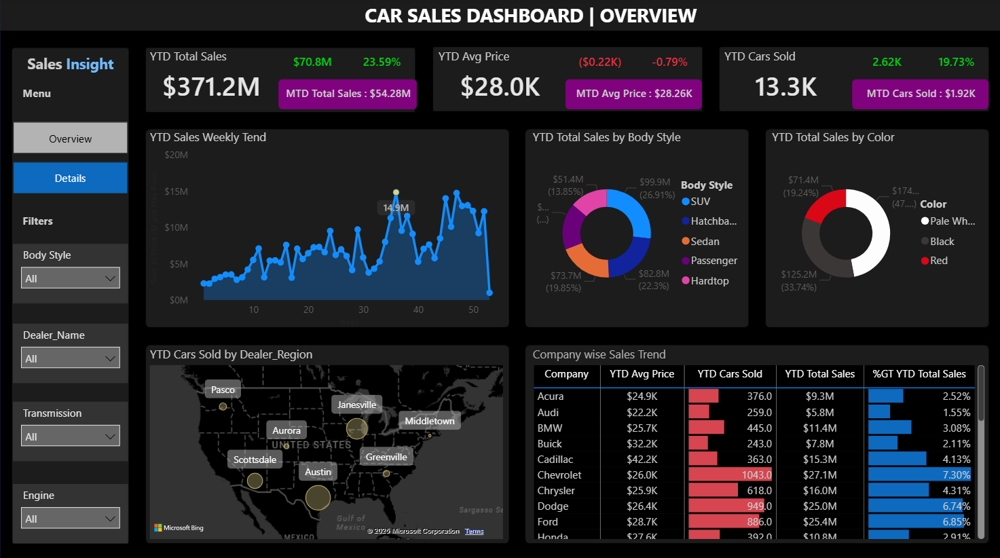
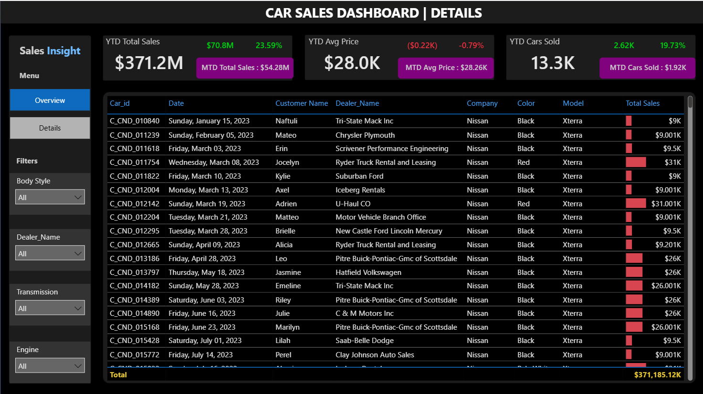

# 🚗 Dynamic Car Sales Dashboard (Power BI)

## 📊 Project Overview
This project showcases an interactive and dynamic car sales dashboard built in **Power BI**.  
The dashboard provides real-time insights into sales performance, customer behavior, and inventory status, helping stakeholders make data-driven decisions.

---

## 💡 Key Features
- Dynamic filtering (by region, car model, time period)
- Visual KPIs (Total Sales, Revenue, Profit Margins)
- Sales trend analysis with forecasting
- Top-performing car models and brands
- Dealer performance and geographical analysis
- Interactive drill-down features

---

## 🔧 Tools & Technologies
- Power BI (Desktop)
- Data Sources: Excel/CSV files and simulated sales data
- DAX (Data Analysis Expressions) for calculated fields and measures
- Power Query for data transformation

---

## 📸 Dashboard Screenshots

### 👉 Overview Page:

### 👉 Details Page:

---

## 🗂 Folder Structure

---

## 🚀 How to Run This Project
1. Clone the repository:  
   `git clone https://github.com/AtulSharma2003/Car-Sales-Dashboard-PowerBI.git`
2. Open `car-sales-dashboard.pbix` in Power BI Desktop.
3. Click `Refresh` to load sample data.
4. Explore and customize the dashboard.

---

## 📥 Data Source
The project uses synthetic sample car sales data, which is included in the `Car Sales (1).xlsx` file.  
Feel free to replace it with your own dataset!

---

## ✏️ Contributing
Contributions are welcome! Please fork the repo and open a pull request with improvements.

---

## 📧 Contact
**Atul Sharma**  
[LinkedIn](https://www.linkedin.com/in/atul-sharma-b8160a239/) | [GitHub]() | Email: Satul5433@gmail.com

